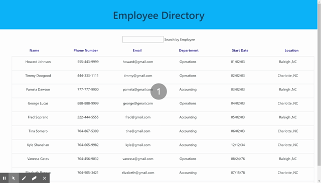

# Employee-Directory

An application that displays an employee directory using react.

The user is able to:
  * Filter the table by name
  * Sort the users by any of the properties by clicking on the property name

## User Story
As a user, I want to be able to view my entire employee directory at once so that I have quick access to their information.

